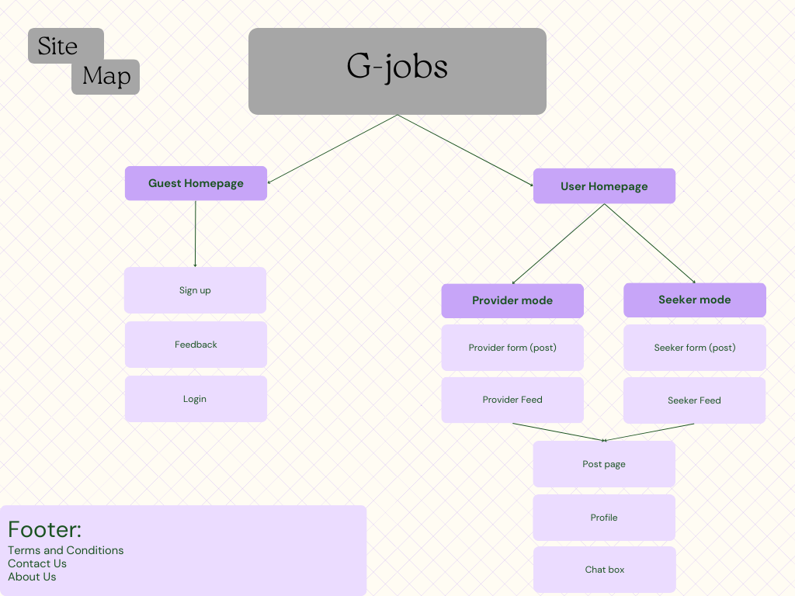

# 🚀 G-Jobs - Connecting Job Seekers & Employers in Algeria 🇩🇿

## 📌 Project Overview

**G-Jobs** is a job-matching platform designed to **connect Algerian job seekers and employers** efficiently. Whether you're searching for a career opportunity, a side job, or the perfect candidate for an open position, **G-Jobs** streamlines the process with smart filtering, messaging, and job tracking features.

### 👥 Team Members:
- **Meftah Zineb**
- **Bouzid Nesrine**
- **Aissat Imane**
- **Aouiguer Rosa**

---

## 🎯 1. Who is This Website For?

### 👤 **Targeted Individuals**
✅ **Age Range:** 18+  
✅ **Gender:** Inclusive for all genders  
✅ **Country:** Algeria  
✅ **Urban/Rural Residents:** Open to all locations  
✅ **Income Level:** Affordable for all job seekers with a small registration fee  
✅ **Education Level:** Depends on the job type and employer’s requirements  
✅ **Occupation:**  
- **Job Seekers:** Unemployed individuals & those looking for side jobs  
- **Job Providers:** Business owners, recruiters, or anyone needing services (e.g., babysitting, housekeeping)  
✅ **Device Access:** Mobile phones, tablets, laptops, and desktop computers  

### 🏢 **Targeted Companies**
✅ **Company Size:** Open to all hiring companies, regardless of scale  
✅ **Who Uses It?** Recruiters, HR managers, or business owners  
✅ **Budget for Hiring:** Varies depending on the company or individual  

---

## 🔥 2. Why Do People Visit This Website?

### 💡 **Key Motivations**
- Job seekers want **employment, career growth, financial stability, and professional advancement**.  
- Employers want to **discover talent, fill open positions, and expand their businesses**.  

### 🎯 **Specific Goals**
- **Find Job Listings or Candidates** tailored to their needs  
- **Apply for Jobs or Post Openings**  
- **Evaluate & Shortlist Candidates**  
- **Communicate with Employers or Applicants**  
- **Track Job Applications & Get Alerts**  

✅ **Time-Sensitive:** Users need the most recent job updates.  
✅ **Essential Need:** Job hunting and hiring are crucial, not just entertainment.  

---

## 📌 3. What Visitors Want to Achieve?

### 🔍 **For Job Seekers**
- Browse & Apply for job offers  
- Update CV & profile  
- Receive notifications when a recruiter shows interest  
- Communicate with potential employers  

### 💼 **For Employers**
- Post job listings & services  
- Find candidates based on CVs & experience  
- Contact job seekers efficiently  

### ✅ **Core Features**
- 🔎 **Smart Job Matching:** Personalized job recommendations  
- 💬 **Messaging System:** Seamless communication between employers & job seekers  
- 📂 **Easy CV Management:** Candidates can upload CVs, employers can filter & shortlist them  
- ⭐ **Ratings & Feedback:** Helps users choose trusted employers/workers  
- 🔔 **Real-Time Alerts:** Notifications for application status & profile visits  

---

## ❓ 4. What Information Do Visitors Need?

📌 **Do visitors need an introduction to the platform?**  
Yes, while people understand job hunting, they will need guidance on how **G-Jobs** works.  

📌 **Are visitors familiar with the concept?**  
Yes, job searching & hiring are widely known processes.  

📌 **Key Differentiator:**  
🚀 **First-of-its-kind in Algeria!** Unlike other platforms, **G-Jobs is inclusive of all adult Algerians and all job types** (from corporate jobs to freelance services).  

---

## 🔄 5. How Often Will People Visit?

- **Job Seekers** will visit frequently **until they find a job**.  
- **Employers** will return **whenever they need to fill a position**.  

---

## 🌍 6. Sitemap

📍 Below is the **website structure** for navigation:

---
